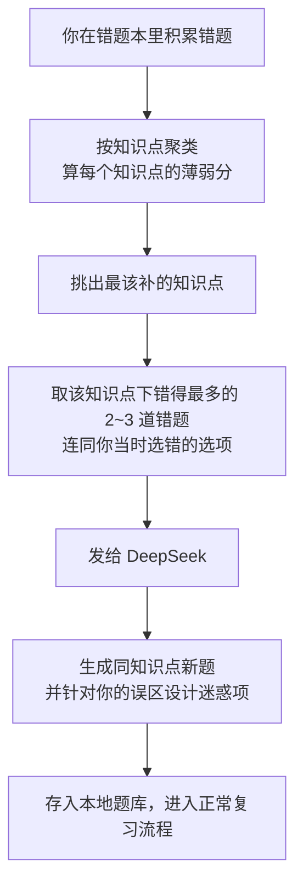

# 408 刷题 PWA

考研 408（数据结构 / 计算机组成原理 / 操作系统 / 计算机网络）刷题应用。
**手机浏览器打开即可用，可加到桌面当 App，离线能刷，推送到 GitHub 后题库自动更新。**

---

## 目录

- [30 秒上手](#30-秒上手)
- [部署到 GitHub（让手机能访问）](#部署到-github让手机能访问)
- [装到手机桌面](#装到手机桌面)
- [功能说明](#功能说明)
- [题库](#题库)
- [录自己的题](#录自己的题)
- [自动更新题库](#自动更新题库)
- [手机电脑进度同步](#手机电脑进度同步)
- [AI 自动出题](#ai-自动出题)
- [目录结构](#目录结构)
- [常用命令](#常用命令)
- [关于版权](#关于版权)

---

## 30 秒上手

在本机预览（浏览器打开 `http://localhost:8080`）：

```powershell
# 在项目根目录执行
C:/Python314/python.exe -m http.server 8080
```

> 必须用 HTTP 服务打开，不能直接双击 `index.html`。因为应用用了 ES 模块和 Service Worker，
> 浏览器的 `file://` 协议下会被安全策略拦住。

---

## 部署到 GitHub（让手机能访问）

1. 在 GitHub 上新建一个仓库（**Public**，免费账号的 Pages 只支持公开仓库）。

2. 把本项目推上去：

```powershell
git init
git add .
git commit -m "feat: 408 刷题 PWA 初始版本"
git branch -M main
git remote add origin https://github.com/<你的用户名>/<仓库名>.git
git push -u origin main
```

3. 打开仓库的 **Settings → Pages**，把 **Source** 改成 **GitHub Actions**。

4. 推送完成后，Actions 会自动跑一遍：
   - 校验题库（有错直接失败，不会把坏题库发出去）
   - 重新生成 `data/bank-manifest.json` 并自动提交回来
   - 部署到 Pages

   几十秒后访问 `https://<你的用户名>.github.io/<仓库名>/` 就能用了。

> ⚠️ **如果部署卡在 `waiting` 不动**：
> 这是 `github-pages` 环境的 **Deployment branches and tags** 被设成了「只允许选定分支」、
> 而白名单是空的，`main` 不在里面。
>
> 到 `Settings → Environments → github-pages → Deployment branches and tags`，
> 选 **All branches**，或者点 **Add deployment branch or tag rule** 手动加一条允许 `main` 的规则。
> 改完部署会立刻放行，不用改代码。

> 这个网址就是你的 App 地址，记下来，手机浏览器直接打开。

---

## 装到手机桌面

| 系统 | 操作 |
|---|---|
| **Android (Chrome / Edge)** | 打开网址 → 右上角菜单 → **安装应用** 或 **添加到主屏幕** |
| **iOS (Safari)** | 打开网址 → 底部**分享**按钮 → **添加到主屏幕** |
| **微信内打开** | 建议改用系统浏览器打开，微信内置浏览器对 PWA 支持有限 |

装完之后：
- 桌面出现「408刷题」图标，点开是全屏，没有浏览器地址栏
- **断网也能刷题**（应用和题库都缓存在本地）
- 联网时会自动同步进度、检查题库更新

---

## 功能说明

### 刷题（首页）

五种模式，都是选择题库范围内的题：

| 模式 | 说明 |
|---|---|
| **开始复习** | 到期该复习的题，按到期时间排序，这是间隔重复的核心 |
| **刷新题** | 没做过的题 |
| **错题重做** | 错过的题，按错误次数排序 |
| **薄弱点推题** | 分析错题涉及的知识点，自动挑相关的新题给你 |
| **随机练习** | 随机抽题，想随便刷刷时用 |

答完之后会立刻显示：
- **正确答案**（选项字母 + 完整选项内容）
- **详细解析**（每道题都有，含推导过程、易错点提示）
- 用时、本题历史错误次数

然后可以点四个按钮告诉系统这道题你掌握得怎么样：

| 按钮 | 什么时候用 | 效果 |
|---|---|---|
| 重来 | 完全不会 | 1 分钟后重新出现（本轮内会再考你一遍） |
| 困难 | 蒙对的 | 间隔增长很慢 |
| 一般 | 想了一会儿答对 | 正常间隔增长 |
| 简单 | 秒答 | 间隔增长最快 |

按钮下方的小字是该选项对应的下次出现时间，不用手动算。
**大部分情况下直接点「下一题」就行**，系统会根据你答对没答对、用了多久自动评一个分，推荐的值会高亮。

### 间隔重复

用的是 SM-2 改良版（Anki 风格的阶梯式）：

```
新题 → [1 分钟] → [10 分钟] → 毕业为复习卡
                                          ↓
                    复习间隔按 1天 → 4天 → 逐渐拉长（间隔倍数依难度动态调整）
                                          ↓
                                   答错就回到 10 分钟重学
```

答错的题会在**本轮内重新出现**（最多 3 次），确保你当场就把它记住。

### 错题本

- 自动收集所有答错的题
- 可按科目筛选
- 可切换「只看未掌握」（连续答对且间隔超过 21 天就视为已掌握，自动移出）
- 点任意一题可以直接重做
- **「根据错题推新题」**：提取你错题涉及的所有知识点，按薄弱程度排序，挑出相关的新题组成一轮

### 统计

- 今日刷题量 / 总正确率 / 已覆盖题数 / 连续打卡天数
- 近 30 天刷题量柱状图
- 近 30 天正确率折线图
- 各科目覆盖进度 + 正确率 + 已掌握题数
- **薄弱知识点排行**（点一下就直接进入针对性刷题）

### 选题库范围

首页右上角「范围」按钮：

- **科目**：四科随便勾
- **章节**：按 408 大纲章节勾选
- **难度**：1★ 基础 ~ 5★ 困难
- **每轮题量**：10 / 20 / 30 / 50 / 100

设置会记住。

---

## 题库

目前内置 **164 道原创题目**，全部带详细解析：

| 科目 | 题数 | 覆盖章节 |
|---|---|---|
| 数据结构 | 44 | 绪论、线性表、栈队列和数组、树与二叉树、图、查找、排序 |
| 计算机组成原理 | 40 | 系统概述、数据表示和运算、存储系统、指令系统、CPU、总线、I/O 系统 |
| 操作系统 | 40 | 系统概述、进程与线程、内存管理、文件管理、I/O 管理 |
| 计算机网络 | 40 | 体系结构、物理层、数据链路层、网络层、传输层、应用层 |

题目按 **408 真题的考察方式和风格**编写：给参数表要求多步计算、手工模拟算法过程（一趟快排、建堆、LRU 缺页、磁盘调度、子网划分、IP 分片、TCP 序号、拥塞窗口）、干扰项只差一位或漏一步，避免偏题怪题。

> ⚠️ 但它们是**原创练习题**，不是历年真题。真实考场上请以真题为准。

---

## 录自己的题

这是最贴合真题的路子——把你整理的真题/错题录进来。

### 1. 用 Excel / CSV 填

打开 `tools/题目导入模板.csv`（用 Excel 打开即可），按列填：

| 列名 | 是否必填 | 说明 |
|---|---|---|
| `id` | 否 | 题号，留空会自动生成。**必须全局唯一** |
| `章节` | 是 | 必须和 `data/subjects.json` 里的章节名一致，否则筛选面板里找不到 |
| `知识点` | 强烈建议 | 用 `|` 或 `、` 分隔，例如 `单链表|插入操作`。**推题功能全靠它** |
| `题型` | 是 | `单选` / `多选` / `判断` / `填空` / `简答` |
| `难度` | 否 | 1~5，默认 2 |
| `题干` | 是 | 换行在 Excel 里按 `Alt+Enter` |
| `A` `B` `C` `D` | 选择题必填 | 选项内容（判断题可以留空，会自动补「正确/错误」） |
| `答案` | 是 | 单选 `B`；多选 `ABD`；判断填 `正确`/`错误`；填空填答案文字 |
| `解析` | **是** | **校验会强制检查，空着不让通过** |
| `可接受答案` | 否 | 填空题的其它正确写法，用 `|` 分隔 |
| `来源` | 否 | 比如「2019 真题 第 5 题」，会显示在解析下方 |

### 2. 导入

```powershell
# 先预览效果（生成 data/ds-imported.json，不动原题库）
C:/Python314/python.exe tools/bank_tool.py import --subject ds --input tools/题目导入模板.csv

# 确认没问题，正式追加进数据结构题库（重复题号会自动跳过）
C:/Python314/python.exe tools/bank_tool.py import --subject ds --input tools/题目导入模板.csv --append
```

`--subject` 可选：`ds`（数据结构）、`co`（组成原理）、`os`（操作系统）、`net`（计算机网络）。

不想用 Excel 也可以直接用 CSV / TSV / 纯文本编辑。

### 3. 校验并发布

```powershell
C:/Python314/python.exe tools/bank_tool.py validate   # 校验
C:/Python314/python.exe tools/bank_tool.py build      # 更新清单
git add . ; git commit -m "题库: 新增 xxx 题" ; git push
```

推送后 GitHub Actions 会自动部署，手机上打开 App 点「我的 → 检查更新」就能拿到新题。

---

## 自动更新题库

让手机端不用重装就能拿到新题目：

1. 部署完成后，打开 App → **我的**
2. 找到「题库更新源」，填入你的仓库名，格式 `用户名/仓库名`，例如 `zhangsan/kaoyan408`
3. 分支填 `main`
4. 加速通道：
   - **jsDelivr CDN**（默认，国内一般能访问）
   - **GitHub Raw 直连**（如果 CDN 抽风就换这个）
5. 回到顶部点「**检查更新**」

设置好后，每次打开 App 会自动在后台检查一次。
更新逻辑是比对每个科目文件的 sha256，只下载有变化的科目，进度和错题记录都不受影响。

---

## 手机电脑进度同步

用 GitHub Gist 做中介，手机和电脑的做题进度、错题记录都能合并，**不会互相覆盖**。

1. 打开 https://github.com/settings/tokens ，新建一个 **Classic Token**
2. 权限**只勾 `gist`** 一项就够了，有效期按需选
3. 复制生成的 Token（`ghp_` 开头）
4. 在 App → **我的 → 多设备同步**：
   - 把 Token 粘进去
   - Gist ID **留空**（会自动帮你建一个私有 Gist）
   - 点「**立即同步**」
5. 另一台设备上，填入**同一个 Token**，把同步后显示的 Gist ID 填进去，点「立即同步」

**合并规则**（不会丢数据）：

- 做题记录：同一道题取更新时间较新的那条
- 答题流水：按 `题号|时间戳` 去重合并，所以两台设备同一天各刷各的也不会重复计数
- **AI 生成的题目**：按题号去重合并，两端的 AI 题会汇总到一起

> ⚠️ **API Key 不会同步**（这是刻意的，避免密钥进入云端）。
> 所以每台设备都要各自填一次 DeepSeek API Key。

> Token 只存在你自己手机/电脑的浏览器本地存储里，不会上传到任何第三方。
> 同步走的是 GitHub 官方 API。

⚠️ 各平台内置浏览器的数据可能被系统清理。**定期点「导出进度」存一份 JSON** 到网盘更保险。

---

## AI 自动出题

除了内置题库，还可以让 **DeepSeek** 在后台自动出题——而且**出的题是根据你的错题来的**，不是凭空生成。

### 它是怎么工作的



关键点：

- **依据是你的错题**。提示词里会带上错题的题干、选项、正确答案、原解析、知识点，
  以及 **你当时选错的那个选项** —— 这让 AI 知道你是"少算了一步"还是"混淆了两个概念"，从而针对性设陷阱。
- **自动触发，不用手点**。开启后会在两个时机自己跑：
  - App 启动后 6 秒（先让首页渲染完，不拖慢启动）
  - 每次答错题之后 12 秒
- **生成的题进入正常复习流程**，走同样的间隔重复算法，之后再错了照样进错题本。
- 除了自动跑，也可以随时手动点「立即生成一批」。

### 开启步骤

1. 到 https://platform.deepseek.com 注册并充值，创建一个 API Key（`sk-` 开头）
2. App → **我的 → AI 自动出题**
3. 把 API Key 填进去
4. 打开「**开启自动出题**」开关

### 花费与安全阀

自动调用会产生费用，所以做了好几层限制：

| 保护机制 | 说明 |
|---|---|
| **默认关闭** | 不主动打开就不会花一分钱 |
| **每日额度** | 默认每天最多 5 道，可自己调（0～50） |
| **每日请求上限** | 取额度的 3 倍，防止失败重试空烧钱 |
| **每个知识点封顶** | 同一知识点最多补 2 道，避免反复出同一个点 |
| **出错自动刹车** | 遇到 Key 无效、余额不足这类错误立即暂停，不会反复失败 |
| **离线自动跳过** | 断网时完全不发请求 |

暂停后会在设置页显示原因，重新打开开关即可恢复。

### 已经实测验证过的事

- `api.deepseek.com` **允许浏览器直接跨域调用**，所以**不需要任何中转服务器**，
  API Key 只存在你手机本地，不经过第三方。
  （这一点是实际发请求验证的：对照了「无跨域头的站点会被拦截」和「GitHub API 正常」两种情况，
  确认测试环境没有关闭跨域检查，DeepSeek 的预检请求和 POST 都正常通过。）
- 模型可选 `deepseek-flash`（快、便宜，推荐）或 `deepseek-v4-pro`（更强、更贵）。
- 用的是 DeepSeek 的 **JSON 输出模式**（`response_format: {type: 'json_object'}`），
  保证返回结构化的题目。拿到结果后还会**逐项校验**：选项必须正好 4 个、答案必须落在选项里、
  解析不能为空。不合格自动重试一次（同时调高温度避免重复），仍不合格就丢弃重来。
- 默认会尝试关闭「深度思考」以加快出题；如果服务端不接受该参数，会自动退回默认设置重试。

### 注意事项

- **AI 出的题可能有错。** 界面上会给这类题打上紫色的「AI 生成 · 答案请核对」标记，
  请自己再核一遍。想全部清掉：**我的 → 清空 AI 题库**。
- 官方文档说明 JSON 模式**偶发返回空内容**，遇到这种情况会自动重试。
- 出题速度取决于网络和模型，`deepseek-flash` + 关闭深度思考通常几秒到十几秒一道。

### 生成的题怎么同步到别的设备

AI 题会跟着进度一起同步（走同一套 GitHub Gist 机制），不需要额外配置：

| 时机 | 行为 |
|---|---|
| 生成之后约 25 秒 | 自动上传（需已配好 Token + Gist ID） |
| App 启动时 | 自动同步一次 |
| 随时 | 我的 → 多设备同步 → 立即同步 |

另一台设备点一次「立即同步」就能拉到这些题，不用重启 App。

> ⚠️ **API Key 本身不同步**。它只存在本机浏览器里，不会进入 Gist。
> 换设备要重新填一次 Key。

---

## 目录结构

```
408/
├── index.html                  页面骨架
├── manifest.webmanifest        PWA 配置（图标、名称、启动方式）
├── sw.js                       Service Worker（离线缓存策略）
├── css/app.css                 全部样式
├── js/
│   ├── app.js                  主控制器：界面渲染、刷题流程、事件绑定
│   ├── store.js                IndexedDB 存储层
│   ├── srs.js                  间隔重复算法（SM-2 改良版）
│   ├── bank.js                 题库加载 / 缓存 / 远程更新
│   ├── recommend.js            薄弱知识点分析 + 根据错题推新题
│   ├── ai.js                   AI 出题（DeepSeek 调用、提示词、结果校验）
│   ├── autoai.js               AI 自动出题调度（额度控制、错题聚类、出错刹车）
│   ├── stats.js                统计计算 + Canvas 图表
│   ├── sync.js                 GitHub Gist 同步
│   └── ui.js                   DOM 工具、Toast、弹层等
├── data/
│   ├── subjects.json           科目与章节定义
│   ├── ds.json                 数据结构题库
│   ├── co.json                 计算机组成原理题库
│   ├── os.json                 操作系统题库
│   ├── net.json                计算机网络题库
│   └── bank-manifest.json      题库清单（版本 + sha256，工具自动生成）
├── icons/                      应用图标
├── tools/
│   ├── bank_tool.py            题库校验 / 清单 / 统计 / 导入
│   ├── make_icons.py           生成应用图标
│   ├── check_workflow.py       校验 GitHub Actions 工作流文件
│   └── 题目导入模板.csv
└── .github/workflows/deploy.yml  自动校验 + 部署到 Pages
```

**没有构建步骤。** 纯静态 HTML + CSS + 原生 ES 模块，改完直接刷新就是最新版。

---

## 常用命令

```powershell
# 本地预览
C:/Python314/python.exe -m http.server 8080

# 校验题库（题号重复、答案不在选项里、缺解析，都会报出来）
C:/Python314/python.exe tools/bank_tool.py validate

# 查看题量分布
C:/Python314/python.exe tools/bank_tool.py stats

# 改了题目后必须执行：更新清单版本号
C:/Python314/python.exe tools/bank_tool.py build

# 导入自己的题目
C:/Python314/python.exe tools/bank_tool.py import --subject ds --input 我的题.csv --append

# 重新生成图标
C:/Python314/python.exe tools/make_icons.py

# 改了 .github/workflows/ 下的文件后必跑：校验工作流
# （YAML 重复 key 之类的问题会让 GitHub 拒绝解析整个工作流，
#   表现是"一个 job 都不启动"，不在本地查很难发现）
C:/Python314/python.exe tools/check_workflow.py
```

### 改了代码后手机怎么拿到新版

Service Worker 按版本号缓存。改完 `js/` 或 `css/` 后：

1. 打开 `sw.js`，把顶部的 `const VERSION = 'v1.0.0'` 加一（比如 `v1.0.1`）
2. 提交并推送
3. 手机上完全关掉 App 再重新打开，就会拉取新版本

---

## 关于版权

- **代码**：本项目代码可自由使用和修改。
- **题目**：`data/` 下的 164 道题是**原创练习题**，基于公开的计算机学科知识点编写，题目文字和解析均为原创，不是历年真题的转录。
- 历年 408 真题由教育部教育考试院组织命题，市面题库（王道、天勤等）享有各自版权。**请不要把受版权保护的题库批量导入本项目并公开分发**——自己整理、自己用没问题，公开分享有侵权风险。

祝你上岸。
